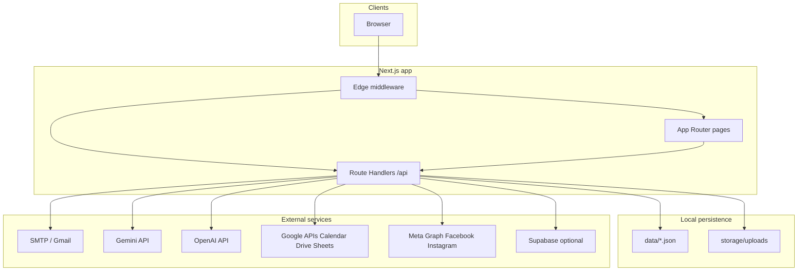

# Minrosh Migration — System Architecture & Developer Guide

**Purpose:** This document describes the *Minrosh Migration* web application so reviewers can understand the system without reading the entire repository. It is suitable for architecture review, security review, vendor onboarding, or platform migration planning.

**Repository:** `minrosh-migration-next` (Next.js 15, React 19). **Primary domain (configured):** `minroshmigration.com.au`.

---

## 1. Executive summary

The codebase is a **single Next.js application** that serves:

1. **Public marketing site** — visa and migration content, contact flows, optional AI chat, newsletter, reviews, tools, and a public **Immigration news** section.
2. **Private admin workspace** (`/admin`) — CRM-style operations (leads, pipeline, inbox, tasks, automations), **customers**, **quotes**, **invoices**, **intelligence** (official-source scanning + AI-assisted drafts + social publishing hooks), **news** editing, **success stories**, **reports**, **audit log**, and **multi-user admin** management.
3. **API routes** — public APIs (contact, chat, news, uploads, portal), authenticated `/api/admin/*`, cron endpoints, and webhooks.

**Persistence model:** Most operational data lives in **JSON files under `data/`** (and private uploads under `storage/uploads/`), with **optional** integrations to Google Workspace (Calendar, Drive, Sheets), SMTP/Gmail, Meta (Facebook/Instagram), Gemini AI, OpenAI, Twilio, and Supabase. There is no mandatory SQL database for core CRM; Supabase is documented as optional for Postgres and public asset hosting.

**Deployment:** Production builds use Next **`output: "standalone"`** (see `next.config.mjs`). Server deployment is scripted for Ubuntu + PM2 (see `scripts/deploy-ubuntu.sh` and related scripts).

---

## 2. Technology stack

| Layer        | Choice                                                                                                                                    |
| ------------ | ----------------------------------------------------------------------------------------------------------------------------------------- |
| Framework    | Next.js 15 (App Router)                                                                                                                   |
| UI           | React 19, Tailwind CSS 3, Radix UI primitives                                                                                             |
| Auth (admin) | Password (+ optional TOTP), signed session cookie; Edge middleware verifies cookie with HMAC using **`ADMIN_SESSION_SECRET` only** (never `ADMIN_PASSWORD`) |
| Data         | File-backed JSON stores + atomic writes; path constants in `lib/admin/paths.js`                                                           |
| PDF / images | `pdf-lib`, `@resvg/resvg-js`, `satori`, `qrcode`                                                                                          |
| AI           | Google Gemini (primary for intelligence + chat paths), OpenAI optional                                                                    |
| Email        | `nodemailer` (SMTP); optional Gmail API for nurture                                                                                       |
| OCR          | `tesseract.js` (server-externalized in Next config)                                                                                       |

---

## 3. High-level architecture

**Request flow (admin):**

1. Requests to `/admin/*` (except `/admin/login`) and `/api/admin/*` hit **middleware** (`middleware.js`).
2. Middleware reads the admin session cookie and verifies the **signed** payload using env secrets only (it cannot read `data/admin-auth.json` in Edge).
3. Authenticated users reach secure admin pages under `app/admin/(secure)/` and corresponding API handlers.

---

## 4. Repository layout (conceptual)

| Path                   | Role                                                                                           |
| ---------------------- | ---------------------------------------------------------------------------------------------- |
| `app/`                 | App Router: marketing pages, `/admin`, `/api/*`                                                |
| `components/`          | Shared UI; `components/admin/*` is the admin shell and feature panels                          |
| `lib/`                 | Domain logic: `lib/admin/*`, `lib/intelligence/*`, `lib/contact.js`, `lib/news-store.js`, etc. |
| `data/`                | JSON stores and seeds (`*.seed.json`). Many runtime files are gitignored in production setups. |
| `storage/uploads/`     | Private customer uploads (not exposed as static `public/` files)                               |
| `public/`              | Static assets                                                                                  |
| `scripts/`             | Build helpers, brochure generation, deploy/update shell scripts                                |
| `supabase/migrations/` | Optional SQL for Supabase (referenced in `.env.example`)                                       |

---

## 5. Public site

**Routing:** Marketing routes are standard Next.js pages under `app/`. Indexable routes and sitemap helpers are centralized in `lib/public-indexable-routes.js` (used by `app/sitemap.js`).

**Global chrome:** Public marketing pages use `components/site-shell.js` for a consistent sticky header and footer. The homepage (`app/page.js`) renders `components/home-page-content.jsx` inside that shell; primary nav can deep-link to in-page sections via hashes (for example `/#quiz`, `/#pathways`). Contact shortcuts in the header come from `components/site-header-meta-row.jsx` (email, phone, destination hub links, and social icons on wide viewports; mobile uses `SiteHeaderMobileUtilities`).

**Notable public features (non-exhaustive):**

- Contact and brochure flows (`app/api/contact`, related `lib/contact.js`).
- Public `**/immigration-news`** — reads curated items from `data/news.json` via `lib/news-store.js` and `app/api/news` / display components.
- Optional `**/api/chat**` — AI concierge (Gemini/OpenAI per env).
- Client document upload via tokenized routes under `app/api/upload/*`.
- Customer **portal** APIs under `app/api/portal/*` (profile, invoices, payment method as applicable).
- `**/api/cron/*`** — scheduled jobs (nurture emails, CRM automation, invoice recurring/reminders/sync, intelligence scan, Facebook publish) protected by shared secrets in headers or query params (see `.env.example`).

---

## 6. Admin application

**UI shell:** `components/admin/admin-shell.jsx` defines primary navigation groups:

- **Dashboard:** Overview (`/admin`)
- **CRM:** CRM dashboard, Customers, Leads, Pipeline, Inbox, Tasks, Automations
- **Finance:** Quotes, Invoices
- **Content:** Intelligence, News, Success Stories
- **Admin:** Reports, Users, Audit Log

**Secure pages:** Implemented under `app/admin/(secure)/*/page.js` (17 feature areas including users, news, intelligence).

**Session and identity:**

- `lib/admin/session.js` — session secret resolution, cookie signing.
- `lib/admin/session-store.js` — token validation semantics.
- Optional **multi-user** admins via `data/admin-users.json` (gitignored); super user + email verification flow (`/api/admin/verify-admin-email`).
- Role model documented in `.env.example` (`ADMIN_ROLE`: owner | staff | readonly).

**Authorization for mutations:** Additional checks in route handlers (e.g. CSRF-ish origin expectations for POSTs in production — see `ADMIN_ALLOW_NO_ORIGIN` in `.env.example`).

---

## 7. Major subsystems

### 7.1 CRM (JSON-backed)

Files such as `crm-leads.json`, `crm-opportunities.json`, `crm-tasks.json`, `crm-interactions.json`, etc. (see `lib/admin/paths.js`). APIs under `app/api/admin/leads`, `opportunities`, `tasks`, `interactions`, `inbox`, `automations`, `reports`, etc.

Optional **Google Sheets** append/summary ranges for CRM sync (env vars in `.env.example`).

### 7.2 Customers & enquiries

Customers: `data/customers.json` + `lib/admin/customers-service.js`. Enquiries path configurable (`ENQUIRIES_FILE`); contact pipeline ties into brochure and nurture.

### 7.3 Invoices & quotes

Invoice domain uses many coordinated JSON files (templates, payments, POs, GRNs, FX, recurring rules, reminders, sync jobs). PDF generation via dedicated routes (e.g. `app/api/admin/invoices/[id]/pdf`). Cron routes for recurring generation, reminders, and optional accounting sync.

### 7.4 Intelligence pipeline

**Goal:** Detect changes from **official** immigration sources, produce **reviewable drafts**, optionally notify admins, and support publishing to **Meta** (and public site copy helpers).

**Provenance & HITL:** Each draft stores a `provenance` array (hub URL, article URLs, timestamps, optional Gemini citation URLs) built in `lib/intelligence/provenance.js` and `scan.js`. Approving a draft requires the admin UI checkbox and `sourcesVerified: true` on `PATCH /api/admin/intelligence/drafts`; the API records `sourcesVerifiedAt` / `sourcesVerifiedIp` on the draft. Automated grounding checks in `lib/intelligence/grounding.js` still apply before publish.

Key modules:

- `lib/intelligence/sources.js` — source catalogue.
- `lib/intelligence/source-crawl.js` / `article-extract.js` — aggregation and text extraction.
- `lib/intelligence/scan.js` — orchestrates scan, hashing, draft creation, optional Gemini merge.
- `lib/intelligence/store.js` — events, drafts, snapshots.
- `lib/intelligence/publish.js`, `facebook.js`, `notifications.js` — publishing and alerts.

Cron: `app/api/cron/intelligence-scan/route.js` (secret: `INTELLIGENCE_CRON_SECRET`).

### 7.5 News (editorial)

Admin CRUD via `app/api/admin/news` and UI `app/admin/(secure)/news`. Public surface: `data/news.json`, `lib/news-store.js`, public routes under `app/immigration-news/`.

### 7.6 Social / Meta

Server-only tokens for Graph API. Poster preview and Facebook posts APIs under `app/api/admin/intelligence/*` and `app/api/social/*`. Webhook for comment events: `app/api/webhooks/facebook-comments`. Optional Supabase bucket for hosting poster PNGs for Meta `image_url` fetches.

**Publish hardening:** `lib/intelligence/facebook.js` re-reads the queue row before calling Graph (skip if `facebookPostRemoteId` already set) and sends a stable `Idempotency-Key` header derived from the queued post id on feed/photo POSTs. Retries still use exponential backoff via `markFacebookPostResult`; a dedicated external job queue remains future work.

### 7.7 Webhooks & integrations

Examples:

- `app/api/webhooks/google-form` — secured with `GOOGLE_FORM_WEBHOOK_SECRET`.
- `app/api/webhooks/whatsapp` — `WHATSAPP_WEBHOOK_SECRET`.
- `app/api/admin/integrations/*` — integration tests and Supabase ping.

### 7.8 Upload retention (privacy hygiene)

Cron route `app/api/cron/upload-retention/route.js` calls `lib/admin/upload-retention.js` to delete `storage/uploads/{customer}` folders when `caseClosedAt` on the customer record is older than `UPLOAD_RETENTION_DAYS` (default 30). Set `caseClosedAt` via `PATCH /api/admin/customers` (allowed field). Cron auth: `UPLOAD_RETENTION_CRON_SECRET`, or fallback to `NURTURE_CRON_SECRET` / `CRON_SECRET` (see route).

---

## 8. Security & compliance notes (for reviewers)

1. **Secrets:** Never commit `.env`. `.env.example` documents variables; production uses strong random values for cron and webhook secrets (minimum lengths enforced in production for some routes).
2. **Admin cookie:** **`ADMIN_SESSION_SECRET` is required** for session cookie HMAC in Edge middleware and Node (`lib/admin/session.js`). Login passwords (env or `data/admin-auth.json`) are separate; they must not be used as the signing key.
3. **CSP & headers:** `Content-Security-Policy` is set **per request in `middleware.js`** (nonces + `strict-dynamic`; production omits `unsafe-eval`). Other headers remain in `next.config.mjs` (`X-Frame-Options`, `nosniff`, etc.). See `lib/csp/build-csp-header.js` and §12.
4. **Contact consent:** Successful `POST /api/contact` attaches `privacyConsentLog` (timestamp, client IP, `PRIVACY_POLICY_VERSION`, `clientConfirmed` from optional `privacyPolicyAccepted`). Set `REQUIRE_PRIVACY_CONSENT_ON_CONTACT=true` to require explicit confirmation.
5. **File storage:** Uploads are intended to stay outside `public/`; access is mediated by API routes with tokens/session logic.
6. **Rate limits:** Optional caps documented for public chat (`CHAT_DAILY_*` in `.env.example`).

---

## 9. Build, test, and deploy

**Scripts (`package.json`):**

- `npm run dev` — local development.
- `npm run build` — verifies assets, `next build`, brochure generation, standalone asset copy.
- `npm run lint` — ESLint.
- `npm run test:contact`, `test:invoice`, `test:smtp` — targeted integration checks.
- `npm run test:unit` — Vitest unit tests (`tests/*.test.mjs`).

**Production build:** `output: "standalone"`; `serverExternalPackages` includes heavy native-ish deps (`tesseract.js`, `@resvg/resvg-js`).

**Deploy:** `scripts/deploy-ubuntu.sh` — `npm ci`, `npm run build`, checks for `.env` and session-related vars, PM2-oriented workflow (see script comments). **Gotcha documented in repo:** a stray `package-lock.json` in `$HOME` can confuse Next tracing root — script warns about this.

---

## 10. Configuration surface (summary)

Configuration is **environment-variable driven**. Major groups:

- **Site:** `NEXT_PUBLIC_SITE_URL`, optional GA, Maps keys.
- **Admin:** passwords, session secret, cookie secure flag, roles, TOTP, optional multi-user file.
- **Mail:** SMTP_* and brochure path.
- **AI:** `GEMINI_API_KEY`, `OPENAI_API_KEY`, model overrides.
- **Intelligence & social:** cron secrets, Meta tokens, optional Supabase bucket for images.
- **Google Workspace:** service account / delegated user, Calendar, Drive, Sheets IDs.
- **Automation:** nurture, CRM automation, invoice crons.
- **Optional:** Supabase, Twilio upload OTP, WhatsApp webhook.

Full authoritative list with comments: `**.env.example`** in the repository root.

---

## 11. Known architectural characteristics (candid)

These are intentional trade-offs reviewers may comment on:

1. **JSON-first operational store** — simplifies deployment and backup but limits concurrent-write scalability and ad hoc querying compared to SQL. **Invoice numbering** uses `lib/admin/invoice-file-lock.js`, which only coordinates within a single Node process; multiple PM2 workers or hosts can still race unless you centralise that concern (e.g. DB sequence).
2. **Monolith** — all features ship in one Next app; operational simplicity vs. blast radius.
3. **Heavy optional integrations** — production may enable only a subset; behavior is env-dependent.
4. **Edge vs Node split** — admin auth verification in middleware cannot depend on filesystem-backed auth files; session signing must be env-backed.

---

## 12. External review — adopted vs roadmap

Feedback from architecture review has been **partially implemented** in code; items below state what is done and what remains.

| Theme | Adopted in repo | Still recommended |
| ----- | --------------- | ----------------- |
| **Data layer** | **Phase 1 Supabase dual-write:** enquiries (`20260414120000_enquiries_mirror.sql` + `enquiries-dual-write.js`); **customers + invoices** (`20260415120000_customers_invoices_mirror.sql` + `crm-dual-write.js`, triggered from `writeCustomers` / `writeInvoices` in `lib/admin/json-store.js`). Customer **delete** best-effort removes `customers_mirror` row. | Phase 2 read from Supabase (JSON fallback), then retire JSON as source of truth for those domains. |
| **Session signing** | **Dedicated `ADMIN_SESSION_SECRET` only** for cookie HMAC. Deploy script requires it. **`npm run generate:admin-session-secret`** prints a value for `.env`. | Rotate secrets per `docs/secrets-rotation-runbook.md`. |
| **CSP** | **Per-request CSP** in `middleware.js` via `lib/csp/build-csp-header.js`: `script-src` uses **nonce + `strict-dynamic`** and trusted third-party script hosts; **`unsafe-eval` only when `NODE_ENV !== 'production'`** (HMR). GA + JSON-LD receive the nonce from `app/layout.js`. Static CSP removed from `next.config.mjs`. | Tighten `style-src` over time; monitor for any third-party script hosts you add. |
| **Intelligence** | **`provenance` array** on drafts; **HITL checkbox + API `sourcesVerified`** before approve. | Stronger legal review workflows, versioned editorial policy. |
| **Meta publish** | **Re-read queue + `Idempotency-Key`**; backoff via `markFacebookPostResult`. **Optional Inngest:** `FACEBOOK_PUBLISH_USE_INNGEST=true`, `app/api/inngest/route.js`, `INNGEST_EVENT_KEY` / `INNGEST_SIGNING_KEY`; cron emits `minrosh/facebook.publish.post`. | Inngest dashboards / DLQ; or BullMQ+Redis if self-hosted. |
| **Privacy / retention** | **`privacyConsentLog`**; optional **`REQUIRE_PRIVACY_CONSENT_ON_CONTACT`**; **`caseClosedAt`** (manual or **auto-set when `status` becomes `past`**) + **`/api/cron/upload-retention`**. **Public contact UIs** require the Privacy Policy checkbox and send **`privacyPolicyAccepted: true`**. | Policy CMS versioning, DSAR tooling. |
| **Testing / CI** | **`vitest`** (`npm run test:unit`, includes quiz scoring + `POST /api/contact` route with mocks), **Playwright** (`npm run test:e2e`, public smoke + **admin → login redirect**), **`.github/workflows/ci.yml`**. **`.npmrc`** sets `legacy-peer-deps` (Inngest peer graph). | Invoice PDF E2E behind CI secrets; webhook contract tests. |

Open questions for the next review cycle: when to flip the **read path** for enquiries to Supabase, and whether Meta’s `Idempotency-Key` behaviour for Page posts should be validated against your Graph API version in staging.

---

## 13. Document control

| Field           | Value                                                             |
| --------------- | ----------------------------------------------------------------- |
| Generated for   | External architecture / developer review                          |
| Scope           | Whole application (public + admin + APIs)                         |
| Source of truth | Repository files at generation time; verify against latest `main` |

*End of document.*